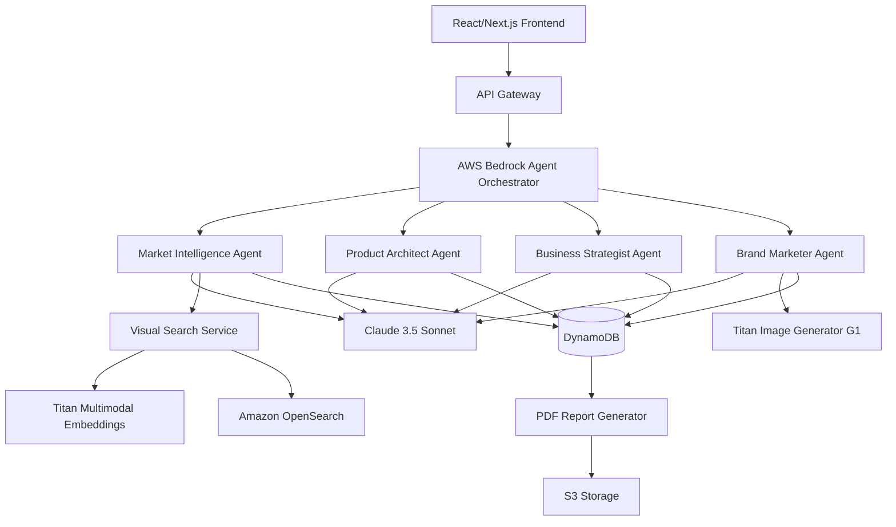
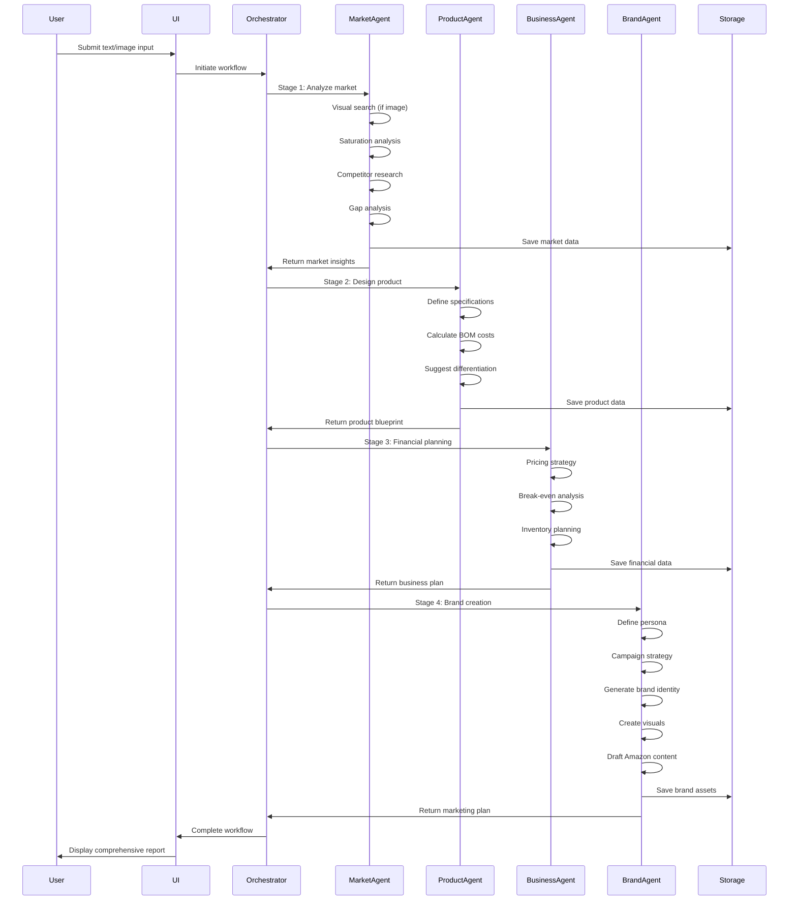
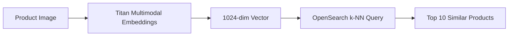
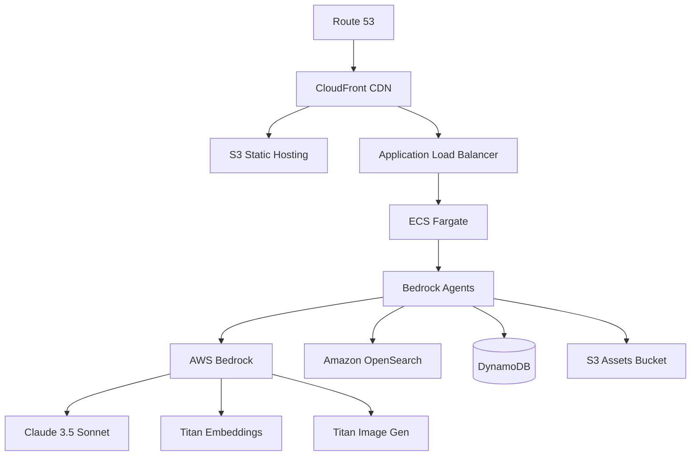

# Design Document

## Overview

Vyapar.AI is an agentic AI system that transforms Indian SMBs and traders into D2C brand owners through an autonomous 4-stage workflow. The system accepts either text descriptions or product photos as input and generates a comprehensive brand launch strategy including market analysis, product specifications, financial forecasting, and marketing assets.

The architecture leverages AWS Bedrock Agents for orchestration, with specialized agents handling distinct business functions: Market Intelligence, Product Architecture, Business Strategy, and Brand Marketing. Each agent operates autonomously while passing structured data to downstream agents, creating a seamless end-to-end business planning pipeline.

## Architecture

### High-Level System Architecture



### Agent Orchestration Flow



## Components and Interfaces

### 1. Frontend Application (React/Next.js)

**Responsibilities:**
- Capture user input (text or image upload)
- Display real-time agent progress and reasoning
- Visualize data (charts, tables, mockups)
- Export final reports

**Key Components:**
- `InputCapture`: Handles text and image input with validation
- `ProgressTracker`: Shows agent status and reasoning steps
- `MarketDashboard`: Displays saturation scores, competitor matrix
- `ProductBlueprint`: Shows specifications and BOM breakdown
- `FinancialSummary`: Presents pricing, break-even, profit margins
- `BrandAssets`: Displays generated visuals and content
- `ReportExporter`: Generates and downloads PDF reports

**Interface:**
```typescript
interface WorkflowInput {
  type: 'text' | 'image';
  content: string | File;
  userId: string;
}

interface AgentProgress {
  stage: 1 | 2 | 3 | 4;
  status: 'pending' | 'in_progress' | 'completed' | 'error';
  currentAction: string;
  reasoning: string[];
  progress: number; // 0-100
}

interface WorkflowOutput {
  marketIntelligence: MarketData;
  productArchitecture: ProductData;
  businessStrategy: FinancialData;
  brandMarketing: BrandData;
  generatedAt: Date;
}
```

### 2. AWS Bedrock Agent Orchestrator

**Responsibilities:**
- Coordinate execution of 4 agent stages
- Manage data flow between agents
- Handle error recovery and retries
- Track workflow state

**Configuration:**
```json
{
  "agentName": "VyaparAI-Orchestrator",
  "foundationModel": "anthropic.claude-3-5-sonnet-20241022-v2:0",
  "instruction": "You are an orchestrator for a brand launch system. Execute 4 stages sequentially: Market Intelligence, Product Architecture, Business Strategy, and Brand Marketing. Pass outputs from each stage to the next.",
  "actionGroups": [
    {
      "actionGroupName": "MarketIntelligence",
      "description": "Analyze market viability and competition"
    },
    {
      "actionGroupName": "ProductArchitecture",
      "description": "Define product specs and calculate costs"
    },
    {
      "actionGroupName": "BusinessStrategy",
      "description": "Generate pricing and financial forecasts"
    },
    {
      "actionGroupName": "BrandMarketing",
      "description": "Create brand identity and marketing assets"
    }
  ]
}
```

### 3. Market Intelligence Agent

**Responsibilities:**
- Process visual or text input
- Perform visual similarity search
- Calculate market saturation
- Analyze competitors
- Extract insights from reviews

**Action Group Functions:**
```typescript
interface MarketIntelligenceActions {
  visualSearch(imageEmbedding: number[]): Promise<SimilarProduct[]>;
  calculateSaturation(category: string): Promise<SaturationScore>;
  analyzeCompetitors(category: string): Promise<CompetitorMatrix>;
  extractGaps(reviews: Review[]): Promise<GapAnalysis>;
}

interface MarketData {
  visualMatches: SimilarProduct[];
  saturationScore: number; // 0-100
  competitors: Competitor[];
  winningFeature: string;
  marketSize: number;
}
```

**Visual Search Pipeline:**


### 4. Product Architect Agent

**Responsibilities:**
- Define technical specifications
- Calculate Bill of Materials costs
- Recommend differentiation features
- Validate feasibility

**Action Group Functions:**
```typescript
interface ProductArchitectActions {
  defineSpecs(category: string, competitorSpecs: Spec[]): Promise<ProductSpec>;
  calculateBOM(specs: ProductSpec): Promise<BOMBreakdown>;
  suggestDifferentiation(gaps: GapAnalysis): Promise<Feature[]>;
}

interface ProductData {
  specifications: {
    [key: string]: { value: string; unit: string; competitive: boolean };
  };
  bom: {
    component: string;
    cost: number; // in INR
    supplier: string;
  }[];
  totalBOMCost: number;
  differentiationFeatures: Feature[];
}
```

**BOM Calculation Logic:**
The agent uses a knowledge base of component costs sourced from Indian and Chinese suppliers:
- Display: ₹800-2500 (based on size and technology)
- Chipset: ₹300-1200 (based on processing power)
- Battery: ₹150-400 (based on mAh capacity)
- Casing: ₹200-600 (based on material)
- Strap: ₹100-300 (based on material)
- Packaging: ₹50-150 (based on premium level)
- Assembly: ₹200-500 (labor cost)

### 5. Business Strategist Agent

**Responsibilities:**
- Develop pricing strategy
- Calculate break-even point
- Forecast profitability
- Plan inventory requirements

**Action Group Functions:**
```typescript
interface BusinessStrategistActions {
  calculatePricing(bomCost: number, competitors: Competitor[]): Promise<PricingStrategy>;
  forecastFinancials(pricing: PricingStrategy, costs: Costs): Promise<FinancialForecast>;
  planInventory(forecast: FinancialForecast): Promise<InventoryPlan>;
}

interface FinancialData {
  launchPrice: number;
  sustainedPrice: number;
  breakEvenUnits: number;
  profitMargin: number; // percentage
  scenarios: {
    units: number;
    revenue: number;
    profit: number;
    roi: number;
  }[];
  inventoryPlan: {
    initialOrder: number;
    reorderLevel: number;
    moq: number;
  };
}
```

**Pricing Formula:**
```
Launch Price = (BOM Cost × 2.5) + (Competitor Avg Price × 0.3)
Sustained Price = Launch Price × 0.85
Break-even Units = Fixed Costs / (Price - Variable Cost per Unit)
Net Profit Margin = ((Price - Total Cost) / Price) × 100
```

### 6. Brand Marketer Agent

**Responsibilities:**
- Define customer persona
- Develop campaign strategy
- Generate brand identity
- Create product visuals
- Draft Amazon listing content

**Action Group Functions:**
```typescript
interface BrandMarketerActions {
  definePersona(productData: ProductData, pricing: PricingStrategy): Promise<CustomerPersona>;
  developCampaign(persona: CustomerPersona): Promise<CampaignStrategy>;
  generateBrandIdentity(category: string, persona: CustomerPersona): Promise<BrandIdentity>;
  createVisuals(brandIdentity: BrandIdentity, specs: ProductSpec): Promise<VisualAssets>;
  draftAmazonContent(productData: ProductData, brandIdentity: BrandIdentity): Promise<AmazonContent>;
}

interface BrandData {
  persona: {
    ageRange: string;
    income: string;
    location: string;
    painPoints: string[];
    motivations: string[];
  };
  campaign: {
    angles: string[];
    channels: { name: string; budget: number }[];
    messaging: { [angle: string]: string };
  };
  brandIdentity: {
    names: string[];
    selectedName: string;
    logoDescription: string;
    tagline: string;
    positioning: string;
  };
  visuals: {
    productMockups: string[]; // S3 URLs
    packagingDesigns: string[]; // S3 URLs
  };
  amazonContent: {
    title: string;
    bullets: string[];
    description: string;
    keywords: string[];
  };
}
```

### 7. Visual Search Service

**Responsibilities:**
- Generate embeddings from uploaded images
- Query vector database for similar products
- Return ranked similarity results

**Implementation:**
```typescript
class VisualSearchService {
  async generateEmbedding(imageBuffer: Buffer): Promise<number[]> {
    const response = await bedrockRuntime.invokeModel({
      modelId: 'amazon.titan-embed-image-v1',
      body: JSON.stringify({
        inputImage: imageBuffer.toString('base64')
      })
    });
    return JSON.parse(response.body).embedding;
  }
  
  async searchSimilar(embedding: number[], k: number = 10): Promise<SearchResult[]> {
    const query = {
      size: k,
      query: {
        knn: {
          image_vector: {
            vector: embedding,
            k: k
          }
        }
      }
    };
    return await opensearchClient.search({ index: 'amazon-products', body: query });
  }
}
```

### 8. Image Generation Service

**Responsibilities:**
- Generate product mockups from specifications
- Create packaging designs with brand elements
- Ensure high-resolution output (2000x2000px minimum)

**Implementation:**
```typescript
class ImageGenerationService {
  async generateProductMockup(prompt: string): Promise<string> {
    const response = await bedrockRuntime.invokeModel({
      modelId: 'amazon.titan-image-generator-v1',
      body: JSON.stringify({
        taskType: 'TEXT_IMAGE',
        textToImageParams: {
          text: prompt,
          negativeText: 'blurry, low quality, distorted'
        },
        imageGenerationConfig: {
          numberOfImages: 1,
          quality: 'premium',
          height: 2048,
          width: 2048,
          cfgScale: 8.0
        }
      })
    });
    const imageBase64 = JSON.parse(response.body).images[0];
    return await this.uploadToS3(imageBase64);
  }
}
```

### 9. Data Storage Layer

**DynamoDB Schema:**

**Table: WorkflowSessions**
```
Partition Key: userId (String)
Sort Key: sessionId (String)
Attributes:
  - createdAt (Number)
  - status (String)
  - inputType (String)
  - inputContent (String)
  - stage1Data (Map)
  - stage2Data (Map)
  - stage3Data (Map)
  - stage4Data (Map)
  - reportUrl (String)
```

**Table: ProductCatalog** (for visual search)
```
Partition Key: productId (String)
Attributes:
  - category (String)
  - brand (String)
  - price (Number)
  - rating (Number)
  - imageUrl (String)
  - specifications (Map)
```

**OpenSearch Index: amazon-products**
```json
{
  "mappings": {
    "properties": {
      "product_id": { "type": "keyword" },
      "category": { "type": "keyword" },
      "brand": { "type": "keyword" },
      "price": { "type": "float" },
      "image_vector": {
        "type": "knn_vector",
        "dimension": 1024,
        "method": {
          "name": "hnsw",
          "space_type": "cosinesimil",
          "engine": "nmslib"
        }
      }
    }
  }
}
```

## Data Models

### Core Domain Models

```typescript
// Input Models
interface TextInput {
  category: string;
  description?: string;
}

interface ImageInput {
  file: File;
  mimeType: string;
  size: number;
}

// Market Intelligence Models
interface SimilarProduct {
  productId: string;
  brand: string;
  price: number;
  imageUrl: string;
  similarityScore: number; // 0-1
}

interface SaturationScore {
  score: number; // 0-100
  activeSellerCount: number;
  topBrandConcentration: number; // percentage
  entryBarrier: 'low' | 'medium' | 'high';
}

interface Competitor {
  brand: string;
  marketShare: number; // percentage
  priceRange: { min: number; max: number };
  avgRating: number;
  keyDifferentiators: string[];
}

interface GapAnalysis {
  totalReviewsAnalyzed: number;
  complaintThemes: {
    theme: string;
    frequency: number;
    severity: number; // 1-10
    exampleReviews: string[];
  }[];
  winningFeature: string;
  opportunityScore: number; // 0-100
}

// Product Architecture Models
interface ProductSpec {
  category: string;
  specifications: {
    [key: string]: {
      value: string;
      unit: string;
      competitive: boolean;
      competitorAvg: string;
    };
  };
}

interface BOMComponent {
  component: string;
  specification: string;
  cost: number; // INR
  supplier: string;
  leadTime: number; // days
}

interface BOMBreakdown {
  components: BOMComponent[];
  totalCost: number;
  currency: 'INR';
  lastUpdated: Date;
}

interface Feature {
  name: string;
  description: string;
  costImpact: number; // INR
  demandScore: number; // 0-100
  competitiveAdvantage: string;
}

// Business Strategy Models
interface PricingStrategy {
  launchPrice: number;
  sustainedPrice: number;
  competitorAvgPrice: number;
  pricePositioning: 'budget' | 'mid-range' | 'premium';
  discountStrategy: string;
}

interface Costs {
  fixedCosts: {
    tooling: number;
    certification: number;
    initialInventory: number;
    total: number;
  };
  variableCosts: {
    bomCost: number;
    shipping: number;
    amazonFees: number; // percentage
    total: number;
  };
}

interface FinancialForecast {
  breakEvenUnits: number;
  breakEvenRevenue: number;
  profitMargin: number; // percentage
  scenarios: ProfitScenario[];
  roiTimeline: { months: number; roi: number }[];
}

interface ProfitScenario {
  units: number;
  revenue: number;
  totalCost: number;
  grossProfit: number;
  netProfit: number;
  roi: number; // percentage
}

interface InventoryPlan {
  initialOrderQty: number;
  reorderLevel: number;
  reorderQty: number;
  moq: number;
  storageCostPerUnit: number;
  monthlyForecast: { month: number; projectedSales: number }[];
}

// Brand Marketing Models
interface CustomerPersona {
  demographic: {
    ageRange: string;
    gender: string;
    income: string;
    occupation: string;
  };
  geographic: {
    tierClassification: 'tier-1' | 'tier-2' | 'tier-3';
    urbanRural: 'urban' | 'semi-urban' | 'rural';
  };
  psychographic: {
    lifestyle: string;
    values: string[];
    painPoints: string[];
    motivations: string[];
  };
  behavioral: {
    shoppingHabits: string[];
    pricesensitivity: 'low' | 'medium' | 'high';
    brandLoyalty: 'low' | 'medium' | 'high';
  };
  marketSize: number; // estimated TAM
}

interface CampaignStrategy {
  marketingAngles: {
    angle: string;
    messaging: string;
    targetSegment: string;
  }[];
  channels: {
    name: string;
    budgetAllocation: number; // percentage
    expectedROAS: number;
    tactics: string[];
  }[];
  contentPillars: string[];
  launchTimeline: { phase: string; duration: string; activities: string[] }[];
}

interface BrandIdentity {
  brandNames: string[];
  selectedName: string;
  logoDescription: string;
  colorPalette: string[];
  typography: string;
  tagline: string;
  positioningStatement: string;
  brandVoice: string;
  domainAvailable: boolean;
  trademarkStatus: string;
}

interface VisualAssets {
  productMockups: {
    url: string;
    angle: 'front' | 'side' | 'lifestyle';
    resolution: string;
  }[];
  packagingDesigns: {
    url: string;
    type: 'box' | 'label' | 'insert';
    resolution: string;
  }[];
}

interface AmazonContent {
  title: string; // max 200 chars
  bullets: string[]; // 5 bullets, max 500 chars each
  description: string; // max 2000 chars
  backendKeywords: string[]; // 10-15 keywords
  searchTerms: string;
  eanCode?: string;
}
```

## Correctness Properties

*A property is a characteristic or behavior that should hold true across all valid executions of a system—essentially, a formal statement about what the system should do. Properties serve as the bridge between human-readable specifications and machine-verifiable correctness guarantees.*


### Property Reflection

After reviewing all testable properties from the prework analysis, several opportunities for consolidation exist:

**Redundancies Identified:**
- Properties 17.1-17.4 all test sequential stage execution and can be combined into one comprehensive workflow ordering property
- Properties 4.1-4.5 all test competitor analysis outputs and can be consolidated into a single comprehensive competitor data property
- Properties 7.1-7.5 all test BOM calculation and can be combined into one comprehensive BOM property
- Properties 15.1-15.5 all test visual generation and can be consolidated
- Properties 16.1-16.5 all test Amazon content generation and can be consolidated

**Consolidated Properties:**
The following properties have been consolidated to eliminate redundancy while maintaining comprehensive coverage:
- Workflow orchestration: Single property covering all stage transitions
- Competitor analysis: Single property covering all competitor data requirements
- BOM calculation: Single property covering component costs and totals
- Visual generation: Single property covering all mockup requirements
- Amazon content: Single property covering all listing content requirements

### Correctness Properties

**Property 1: Input validation accepts valid formats**
*For any* text input describing a product category or image file in JPEG/PNG/WebP format under 10MB, the system should accept and validate the input successfully.
**Validates: Requirements 1.1, 1.2**

**Property 2: Invalid input rejection**
*For any* invalid input (empty text, unsupported image format, or file size exceeding 10MB), the system should reject the input and return a clear error message.
**Validates: Requirements 1.3**

**Property 3: Workflow initiation on valid input**
*For any* valid input (text or image), the system should automatically initiate the 4-stage agentic workflow.
**Validates: Requirements 1.4**

**Property 4: Embedding dimension consistency**
*For any* uploaded product image, the generated multimodal embedding should be a vector of exactly 1024 dimensions.
**Validates: Requirements 2.1, 20.3**

**Property 5: Similarity score filtering**
*For any* visual search results, all returned products should have similarity scores greater than or equal to 0.75.
**Validates: Requirements 2.3**

**Property 6: Agent data flow**
*For any* completed agent stage, the output data should be automatically passed to the next stage in the workflow.
**Validates: Requirements 2.5, 17.2, 17.3, 17.4**

**Property 7: Saturation score bounds**
*For any* market analysis, the calculated Market Saturation Score should be between 0 and 100 inclusive.
**Validates: Requirements 3.2**

**Property 8: Saturation flagging logic**
*For any* Market Saturation Score, if the score exceeds 75, the category should be flagged as highly competitive; if below 50, it should indicate favorable conditions.
**Validates: Requirements 3.3, 3.4**

**Property 9: Competitor data completeness**
*For any* category analysis, the system should identify up to 10 top brands, calculate market share percentages that sum to 100%, and include brand names, price ranges, average ratings, and key differentiators for each competitor.
**Validates: Requirements 4.1, 4.2, 4.3, 4.4**

**Property 10: Negative review filtering**
*For any* competitor review extraction, only reviews with ratings between 1 and 3 stars (inclusive) should be included in the analysis.
**Validates: Requirements 5.1**

**Property 11: Review analysis threshold**
*For any* major competitor, the system should analyze at least 500 reviews before completing gap analysis.
**Validates: Requirements 5.2**

**Property 12: Complaint theme ranking**
*For any* set of identified complaint themes, they should be ranked in descending order by frequency and severity.
**Validates: Requirements 5.4**

**Property 13: Specification superiority**
*For any* generated product specifications, at least one specification should exceed the category average.
**Validates: Requirements 6.2**

**Property 14: Specification measurability**
*For any* product specification, it should include a measurable value with appropriate units (e.g., inches, mAh, grams).
**Validates: Requirements 6.3**

**Property 15: BOM completeness and arithmetic**
*For any* Bill of Materials, it should itemize costs in INR for display, chipset, battery, casing, strap, packaging, and assembly, and the sum of component costs should equal the total BOM cost.
**Validates: Requirements 7.1, 7.3, 7.4**

**Property 16: Differentiation feature bounds**
*For any* gap analysis with identified opportunities, the system should suggest between 3 and 5 differentiation features (inclusive).
**Validates: Requirements 8.2**

**Property 17: Feature cost attribution**
*For any* suggested differentiation feature, it should include an estimated incremental cost impact in Indian Rupees.
**Validates: Requirements 8.3**

**Property 18: Pricing calculation completeness**
*For any* BOM cost input, the system should calculate both a Launch Price and a Sustained Price, considering competitor pricing, BOM cost, and target margin.
**Validates: Requirements 9.1, 9.2, 9.3**

**Property 19: Break-even formula correctness**
*For any* pricing and cost inputs, the break-even calculation should include both fixed costs (tooling, certification, initial inventory) and variable costs (per-unit BOM), and the formula should be: Break-even Units = Fixed Costs / (Price - Variable Cost per Unit).
**Validates: Requirements 10.1, 10.2**

**Property 20: Financial scenario coverage**
*For any* financial forecast, the system should generate profit scenarios for exactly four sales volumes: 500, 1000, 2000, and 5000 units.
**Validates: Requirements 10.4**

**Property 21: Inventory forecast duration**
*For any* completed inventory plan, the system should provide exactly 6 months of inventory forecast data.
**Validates: Requirements 11.4**

**Property 22: Customer persona completeness**
*For any* generated customer persona, it should include age range, income level, geographic tier classification, lifestyle attributes, pain points, and purchase motivations.
**Validates: Requirements 12.2, 12.3**

**Property 23: Marketing angle bounds**
*For any* customer persona, the system should recommend between 3 and 5 marketing angles (inclusive).
**Validates: Requirements 13.1**

**Property 24: Budget allocation sum**
*For any* set of recommended marketing channels, the budget allocation percentages should sum to exactly 100%.
**Validates: Requirements 13.4**

**Property 25: Brand name generation count**
*For any* campaign strategy development, the system should generate exactly 5 brand name options.
**Validates: Requirements 14.1**

**Property 26: Visual asset completeness**
*For any* brand identity, the system should generate at least 3 product mockup angles (front, side, lifestyle), packaging design mockups, and all images should have minimum resolution of 2000x2000 pixels.
**Validates: Requirements 15.2, 15.3, 15.5**

**Property 27: Amazon content structure**
*For any* generated Amazon listing, it should include exactly 5 bullet points, and the title should not exceed 200 characters, each bullet should not exceed 500 characters, and the description should not exceed 2000 characters.
**Validates: Requirements 16.2, 16.5**

**Property 28: Backend keyword bounds**
*For any* Amazon listing content, the system should suggest between 10 and 15 backend search keywords (inclusive).
**Validates: Requirements 16.4**

**Property 29: Sequential workflow execution**
*For any* workflow execution, Stage 1 (Market Intelligence) must complete before Stage 2 (Product Architect) begins, Stage 2 must complete before Stage 3 (Business Strategist) begins, and Stage 3 must complete before Stage 4 (Brand Marketer) begins.
**Validates: Requirements 17.1, 17.2, 17.3, 17.4**

**Property 30: Workflow completion generates report**
*For any* workflow where all 4 stages complete successfully, the system should generate a comprehensive PDF report containing all outputs.
**Validates: Requirements 17.5**

**Property 31: Progress transparency**
*For any* agent processing activity, the system should display real-time status updates and reasoning steps in the user interface.
**Validates: Requirements 18.1, 18.2**

**Property 32: Error message clarity**
*For any* error that occurs during workflow execution, the system should display a clear error message with suggested corrective actions.
**Validates: Requirements 18.5**

**Property 33: Data persistence on completion**
*For any* completed workflow, all generated data should be saved to the user's account and be available for export as PDF.
**Validates: Requirements 19.1, 19.2**

**Property 34: Export content completeness**
*For any* PDF export, it should include all visualizations, tables, and generated images from the workflow.
**Validates: Requirements 19.3**

**Property 35: Export performance**
*For any* export request, the PDF file should be generated within 30 seconds.
**Validates: Requirements 19.4**

## Error Handling

### Error Categories and Recovery Strategies

**1. Input Validation Errors**
- Invalid file format or size
- Empty or malformed text input
- Strategy: Return clear error message with format requirements, allow user to retry

**2. External Service Errors**
- AWS Bedrock API failures
- OpenSearch unavailability
- Image generation timeouts
- Strategy: Implement exponential backoff retry (3 attempts), fallback to cached data where possible, notify user of service issues

**3. Data Quality Errors**
- Insufficient competitor data
- No reviews found for analysis
- Empty search results
- Strategy: Provide partial results with warnings, suggest alternative categories, allow manual data input

**4. Calculation Errors**
- Invalid BOM component costs
- Negative profit margins
- Break-even calculation failures
- Strategy: Validate inputs before calculation, use default values with warnings, log errors for review

**5. Generation Errors**
- Image generation failures
- Brand name generation issues
- Content formatting errors
- Strategy: Retry with adjusted prompts, provide fallback templates, allow manual editing

### Error Response Format

```typescript
interface ErrorResponse {
  code: string;
  message: string;
  stage: 1 | 2 | 3 | 4 | null;
  suggestedAction: string;
  retryable: boolean;
  details?: any;
}
```

### Circuit Breaker Pattern

For external service calls (Bedrock, OpenSearch), implement circuit breaker:
- Open circuit after 3 consecutive failures
- Half-open after 30 seconds to test recovery
- Close circuit after 2 successful calls

## Testing Strategy

### Unit Testing

**Framework:** Jest for TypeScript/JavaScript components

**Coverage Areas:**
- Input validation logic (file format, size, text validation)
- Data transformation functions (market data parsing, BOM calculations)
- Pricing formula calculations
- Content formatting (Amazon character limits)
- Error handling and recovery logic

**Example Unit Tests:**
```typescript
describe('Input Validation', () => {
  test('accepts valid JPEG image under 10MB', () => {
    const file = createMockFile('image.jpg', 'image/jpeg', 5 * 1024 * 1024);
    expect(validateImageInput(file)).toBe(true);
  });
  
  test('rejects image over 10MB', () => {
    const file = createMockFile('large.jpg', 'image/jpeg', 11 * 1024 * 1024);
    expect(validateImageInput(file)).toBe(false);
  });
});

describe('BOM Calculation', () => {
  test('sums component costs correctly', () => {
    const components = [
      { name: 'Display', cost: 1000 },
      { name: 'Chipset', cost: 500 },
      { name: 'Battery', cost: 300 }
    ];
    expect(calculateTotalBOM(components)).toBe(1800);
  });
});

describe('Pricing Strategy', () => {
  test('calculates launch price with correct formula', () => {
    const bomCost = 2000;
    const competitorAvg = 3000;
    const launchPrice = calculateLaunchPrice(bomCost, competitorAvg);
    expect(launchPrice).toBe(bomCost * 2.5 + competitorAvg * 0.3);
  });
});
```

### Property-Based Testing

**Framework:** fast-check for JavaScript/TypeScript

**Configuration:** Each property test should run a minimum of 100 iterations to ensure comprehensive coverage across the input space.

**Test Tagging:** Each property-based test must include a comment explicitly referencing the correctness property from the design document using this format: `**Feature: vyapar-ai, Property {number}: {property_text}**`

**Coverage Areas:**

**Property Test 1: Input Validation**
```typescript
/**
 * **Feature: vyapar-ai, Property 1: Input validation accepts valid formats**
 */
test('accepts all valid input formats', () => {
  fc.assert(
    fc.property(
      fc.oneof(
        fc.record({
          type: fc.constant('text'),
          content: fc.string({ minLength: 1, maxLength: 500 })
        }),
        fc.record({
          type: fc.constant('image'),
          format: fc.constantFrom('image/jpeg', 'image/png', 'image/webp'),
          size: fc.integer({ min: 1, max: 10 * 1024 * 1024 })
        })
      ),
      (input) => {
        const result = validateInput(input);
        expect(result.valid).toBe(true);
      }
    ),
    { numRuns: 100 }
  );
});
```

**Property Test 2: Saturation Score Bounds**
```typescript
/**
 * **Feature: vyapar-ai, Property 7: Saturation score bounds**
 */
test('saturation score always between 0 and 100', () => {
  fc.assert(
    fc.property(
      fc.record({
        activeSellerCount: fc.integer({ min: 0, max: 100000 }),
        topBrandConcentration: fc.float({ min: 0, max: 1 })
      }),
      (marketData) => {
        const score = calculateSaturationScore(marketData);
        expect(score).toBeGreaterThanOrEqual(0);
        expect(score).toBeLessThanOrEqual(100);
      }
    ),
    { numRuns: 100 }
  );
});
```

**Property Test 3: BOM Arithmetic**
```typescript
/**
 * **Feature: vyapar-ai, Property 15: BOM completeness and arithmetic**
 */
test('BOM total equals sum of components', () => {
  fc.assert(
    fc.property(
      fc.array(
        fc.record({
          component: fc.constantFrom('display', 'chipset', 'battery', 'casing', 'strap', 'packaging', 'assembly'),
          cost: fc.float({ min: 50, max: 5000 })
        }),
        { minLength: 7, maxLength: 7 }
      ),
      (components) => {
        const bom = generateBOM(components);
        const expectedTotal = components.reduce((sum, c) => sum + c.cost, 0);
        expect(bom.totalCost).toBeCloseTo(expectedTotal, 2);
      }
    ),
    { numRuns: 100 }
  );
});
```

**Property Test 4: Budget Allocation Sum**
```typescript
/**
 * **Feature: vyapar-ai, Property 24: Budget allocation sum**
 */
test('marketing budget allocations sum to 100%', () => {
  fc.assert(
    fc.property(
      fc.array(
        fc.record({
          channel: fc.string(),
          allocation: fc.float({ min: 0, max: 100 })
        }),
        { minLength: 2, maxLength: 6 }
      ),
      (channels) => {
        const strategy = generateCampaignStrategy(channels);
        const totalAllocation = strategy.channels.reduce((sum, c) => sum + c.budgetAllocation, 0);
        expect(totalAllocation).toBeCloseTo(100, 1);
      }
    ),
    { numRuns: 100 }
  );
});
```

**Property Test 5: Sequential Workflow Execution**
```typescript
/**
 * **Feature: vyapar-ai, Property 29: Sequential workflow execution**
 */
test('stages execute in correct order', () => {
  fc.assert(
    fc.property(
      fc.record({
        type: fc.constantFrom('text', 'image'),
        content: fc.string()
      }),
      async (input) => {
        const executionLog = [];
        const workflow = new WorkflowOrchestrator({
          onStageStart: (stage) => executionLog.push(stage)
        });
        
        await workflow.execute(input);
        
        expect(executionLog).toEqual([1, 2, 3, 4]);
      }
    ),
    { numRuns: 100 }
  );
});
```

**Property Test 6: Amazon Content Character Limits**
```typescript
/**
 * **Feature: vyapar-ai, Property 27: Amazon content structure**
 */
test('Amazon content respects character limits', () => {
  fc.assert(
    fc.property(
      fc.record({
        productName: fc.string(),
        features: fc.array(fc.string(), { minLength: 5, maxLength: 10 }),
        description: fc.string()
      }),
      (productData) => {
        const content = generateAmazonContent(productData);
        
        expect(content.title.length).toBeLessThanOrEqual(200);
        expect(content.bullets).toHaveLength(5);
        content.bullets.forEach(bullet => {
          expect(bullet.length).toBeLessThanOrEqual(500);
        });
        expect(content.description.length).toBeLessThanOrEqual(2000);
      }
    ),
    { numRuns: 100 }
  );
});
```

### Integration Testing

**Test Scenarios:**
1. End-to-end workflow with text input
2. End-to-end workflow with image input
3. Visual search integration with OpenSearch
4. Image generation integration with Bedrock
5. Data persistence and retrieval from DynamoDB
6. PDF report generation with all components

**Mock Strategy:**
- Mock external AWS services (Bedrock, OpenSearch) for unit tests
- Use AWS LocalStack for integration tests
- Create test fixtures for market data, competitor information

### Performance Testing

**Benchmarks:**
- Visual search query: < 2 seconds
- Market analysis stage: < 30 seconds
- Product architecture stage: < 20 seconds
- Business strategy stage: < 15 seconds
- Brand marketing stage: < 45 seconds (including image generation)
- Total workflow: < 2 minutes
- PDF export: < 30 seconds

**Load Testing:**
- Concurrent users: 100
- Requests per second: 50
- Test duration: 10 minutes

## Deployment Architecture

### AWS Infrastructure



### Environment Configuration

**Development:**
- Single region (ap-south-1 Mumbai)
- Minimal OpenSearch cluster (1 node)
- DynamoDB on-demand pricing
- Bedrock with rate limiting

**Production:**
- Multi-region (ap-south-1 primary, ap-southeast-1 backup)
- OpenSearch cluster (3 nodes, multi-AZ)
- DynamoDB provisioned capacity with auto-scaling
- CloudFront for global distribution
- WAF for security

### Monitoring and Observability

**Metrics:**
- Workflow completion rate
- Average workflow duration per stage
- Error rate by stage and error type
- API latency (p50, p95, p99)
- Bedrock API usage and costs
- OpenSearch query performance

**Logging:**
- CloudWatch Logs for application logs
- X-Ray for distributed tracing
- Agent reasoning logs for debugging
- User interaction logs for analytics

**Alerts:**
- Workflow failure rate > 5%
- API latency p95 > 5 seconds
- Bedrock API errors > 10/minute
- OpenSearch cluster health yellow/red
- DynamoDB throttling events

## Security Considerations

**Authentication & Authorization:**
- AWS Cognito for user authentication
- JWT tokens for API access
- Role-based access control (RBAC)
- API Gateway with IAM authorization

**Data Protection:**
- Encryption at rest (S3, DynamoDB, OpenSearch)
- Encryption in transit (TLS 1.3)
- Sensitive data masking in logs
- Regular security audits

**Input Validation:**
- File type verification (magic bytes check)
- Image content scanning for inappropriate content
- SQL injection prevention
- XSS protection

**Rate Limiting:**
- Per-user workflow limits (10 per day)
- API rate limiting (100 requests/minute)
- Bedrock API quota management
- Cost controls and budget alerts

## Future Enhancements

**Phase 2 Features:**
- Multi-category analysis (compare opportunities across categories)
- Supplier marketplace integration (direct sourcing)
- Real-time Amazon pricing updates
- Competitor tracking dashboard

**Phase 3 Features:**
- Automated listing creation on Amazon
- Inventory management integration
- Sales analytics and forecasting
- Marketing campaign automation

**Technical Improvements:**
- Fine-tuned models for Indian market specifics
- Custom embedding models for product similarity
- Real-time collaboration features
- Mobile application (iOS/Android)
